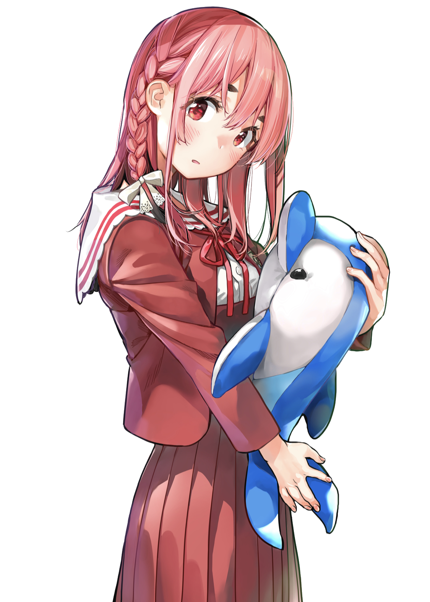

# kanokari

***Kanojo Okarishimasu website project!***

 
 

## Index

- [Index](#index)
- [Purpose](#purpose)
- [Deployment](#deployment)
- [Contributing](#contributing)
- [Authors](#authors)
- [Licensing](#licensing)

## Purpose

Thought it would be fun to make public this project I built a while ago.

I was scrolling my Instagram feed when I saw this design from [*@kitsune.aep*](https://www.instagram.com/kitsune.aep/) (now [*@designs.by.kitsune*](https://www.instagram.com/designs.by.kitsune/)).

> **Note**  
> The design is not up anymore on their page

I then reached them to make the website.

Here are archives of two steps in the development of this landing page (meant to show them the progress):

- `KanoKari Prototype 1`: <https://youtu.be/pG9zUP0vzb4>
- `KanoKari Prototype 2`: <https://youtu.be/3oz8fv5aIOA>

## Deployment

There is a live version available at:

<https://kanojo-okarishimasu.netlify.app/>

Feel free to report any issue you might encounter on this GitHub page.

## Contributing

Although this project has been abandoned for now, pull requests are welcome.

For major changes, please open a discussion first to discuss what you would like to change.

## Authors

- **Animenosekai** - *Initial work* - [Animenosekai](https://github.com/Animenosekai)
- **Kitsune** - *Design* - [*@designs.by.kitsune*](https://www.instagram.com/designs.by.kitsune/)
- **Reiji Miyajima** - *Characters* - [*@Miyajimareiji*](https://twitter.com/miyajimareiji)

## Licensing

This software is licensed under the MIT License. See the [*LICENSE*](./LICENSE) file for more information.
